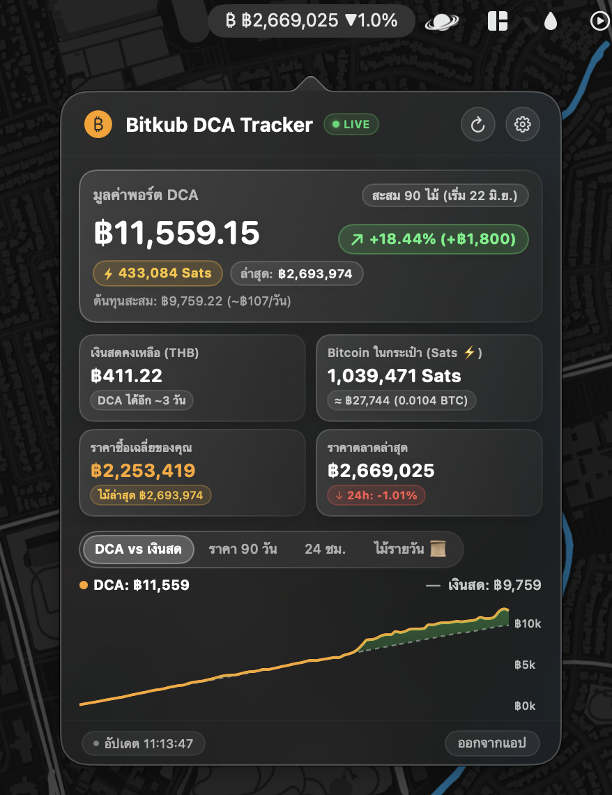

<div align="center">

# ₿ Bitkub BTC Bar

**macOS Menu Bar สำหรับคน DCA Bitcoin บน Bitkub**  
ดูพอร์ตสะสม, กำไร/ขาดทุน, จำนวน Sats, และราคา BTC ล่าสุดแบบเรียลไทม์ ในดีไซน์ Liquid Glass

<br/>



<br/><br/>

[](https://apple.com/macos)
[](https://swift.org)
[](LICENSE)

</div>

---

### ทำไมต้องมีแอปนี้?

ถ้าคุณเป็นคนที่ตั้ง DCA Bitcoin บน Bitkub ไว้ทุกวัน ปัญหาที่เจอบ่อยๆ คือ:
- อยากรู้ว่าตอนนี้พอร์ตโตไปแค่ไหนแล้ว แต่ขี้เกียจเปิดแอปหรือล็อกอินเข้าเว็บ Bitkub ไปดู
- DCA หลุดบ่อยเพราะ **ลืมเติมเงินบาท** เงินสดในบัญชีหมดกะทันหัน
- อยากสะสมเป็นหน่วย **Satoshis (Sats ⚡️)** แต่หน้าเว็บแสดงแค่ทศนิยมยาวๆ

**Bitkub BTC Bar** เลยถูกสร้างขึ้นมาเพื่อให้ชีวิตง่ายขึ้น อยู่บนแถบเมนูด้านบนของ Mac คลิกเดียวเห็นครบ จบในหน้าต่างเดียว

---

### ฟีเจอร์เด่น

- ⚡️ **DCA Portfolio & Sats Counter**  
  ดึงประวัติไม้ DCA อัตโนมัติ คำนวณต้นทุนเฉลี่ย กำไร/ขาดทุน (ทั้ง THB และ %) พร้อมนับจำนวน Sats ที่คุณสะสมได้
- 📜 **ประวัติไม้ DCA รายวัน**  
  ดูย้อนหลังได้ชัดๆ ว่าแต่ละวันระบบซื้อไปที่ราคาเท่าไหร่ และได้มาคนละกี่ Sats
- 📊 **เปรียบเทียบ DCA vs เก็บเงินสด**  
  มีกราฟ SwiftUI ช่วยจำลองให้เห็นชัดๆ ว่าเงินที่เรา DCA ไว้ โตต่างจากการเก็บเป็นเงินสดเฉยๆ ขนาดไหน พร้อมกราฟราคา 90 วันและเส้นต้นทุนเฉลี่ย
- ⚠️ **แจ้งเตือนก่อนเงินบาทหมด**  
  คำนวณจากยอดซื้อเฉลี่ยต่อวัน แล้วเตือนล่วงหน้า (เช่น เหลือไม่ถึง 2–3 วัน) พร้อมปุ่มกดไปหน้าเติมเงินของ Bitkub ได้ทันที
- 🎛️ **สลับการแสดงผลบน Menu Bar ได้**  
  เลือกได้ว่าจะให้แถบเมนูด้านบนโชว์ **[ มูลค่าพอร์ต + % กำไร DCA ]** หรือ **[ ราคาตลาด BTC + % 24h ]**
- 🫧 **Apple Liquid Glass UI**  
  ใช้ `.ultraThinMaterial` และ vibrancy แท้ของ macOS โปร่งแสง มีมิติความลึก กลมกลืนกับ Wallpaper และธีมของเครื่อง

---

### วิธีติดตั้ง

#### 1. ติดตั้งผ่าน Homebrew (แนะนำ)
```bash
brew install --cask https://raw.githubusercontent.com/greenoxz/bitkub-btc-bar/main/Casks/bitkub-btc-bar.rb
```

#### 2. หรือติดตั้งผ่าน Terminal คำสั่งเดียว
```bash
curl -fsSL https://raw.githubusercontent.com/greenoxz/bitkub-btc-bar/main/install.sh | bash
```

*(หรือจะดาวน์โหลดไฟล์ `BitkubBtcBar.zip` จากหน้า [Releases](https://github.com/greenoxz/bitkub-btc-bar/releases) ไปลากใส่โฟลเดอร์ Applications เองก็ได้เช่นกัน)*

---

### วิธีเริ่มใช้งาน

1. เข้าเว็บ [Bitkub.com](https://www.bitkub.com) ไปที่ **Settings** > **API**
2. สร้าง API Key ใหม่:
   - ติ๊กเฉพาะสิทธิ์ **Read** และ **Wallet**
   - **ไม่ต้องติ๊ก** สิทธิ์ Trade หรือ Withdraw
3. กดที่ไอคอน ₿ บน Menu Bar > รูปฟันเฟือง ⚙️ > วาง Key & Secret แล้วกด **บันทึกข้อมูล**
4. ข้อมูลพอร์ตจะซิงค์และเริ่มคำนวณให้อัตโนมัติทันที

---

### ปลอดภัยแค่ไหน?

- **Local 100%:** ไม่มีเซิร์ฟเวอร์คนกลาง ไม่มีการส่ง API Key ไปที่อื่นใดทั้งสิ้น ทุกอย่างทำงานตรงระหว่าง Mac ของคุณกับ `api.bitkub.com`
- **สิทธิ์ขั้นต่ำ:** ขอแค่สิทธิ์อ่านยอดเงินและประวัติออเดอร์ (Read & Wallet) ตัวคีย์จึงไม่สามารถสั่งซื้อขายหรือถอนเงินแทนคุณได้แน่นอน

---

### สเปกที่รองรับ

- macOS Ventura (13.0) ขึ้นไป
- ใช้งานได้ทั้ง Mac ชิป Apple Silicon (M1/M2/M3/M4) และ Intel

---

<div align="center">
  <sub>Made with ❤️ for Bitcoin DCA Stackers • MIT License</sub>
</div>
